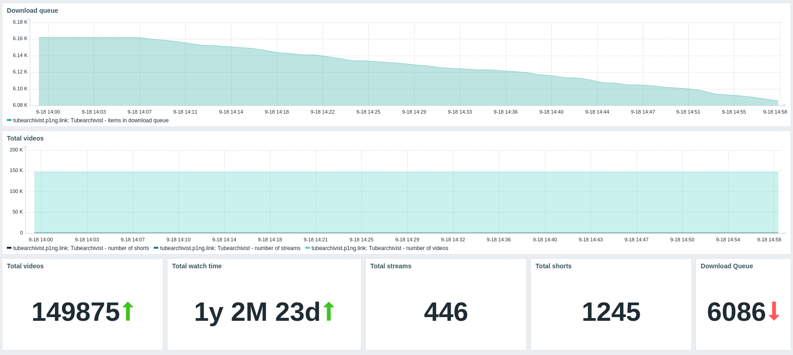
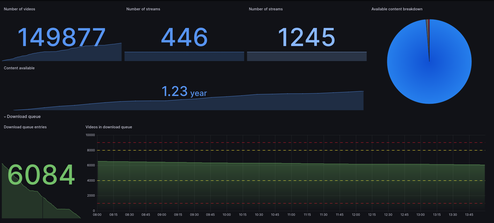

# Tubearchivist-Zabbix
Allows you to monitor and record your Tubearchivist collection using Zabbix. Since Zabbix is very flexible, you can automate a lot with the TA API, when combined with triggers.

## Features
### Triggers
* No downloads happened in the past week
* No downloads happening despite download queue not empty
* Check if tubearchivist is throttled
### Supported items
* Total number of videos, streams, shorts
* Download queue progress
* Download speed (will vary greatly depending on downloading video/audio)

### Automatic restart of downloads
In case of downloads randomly quitting, Zabbix can restart your download queue for you via a custom Alert script.

Depending on how far you integrated Zabbix into your environment, you could additionally kill tubearchivist after a set amount of failures.

## Requirements
* Tested using Tubearchivist 0.5.0 and Zabbix 7.0.6, YMMV
* Tubearchivist needs to be accessible via Zabbix Server
* [Tubearchivist API key](https://docs.tubearchivist.com/api/introduction/#authentication)

# Screenshots
Example dashboards you can build with this data
## Zabbix Dashboard

## Grafana

# Installation
## Create an API token for zabbix
See [here](docs/api_key.md)
## Importing the template
Download [this file](template/zabbix_tubearchivist.yaml) and import it as template.

Then, add a new Host and set two Macros:

* `{$TA_URL}`: This is the URL tubearchivist is reachable at, for example, `https://tubearchivist.example.com`
* `{$TA_TOKEN}`: The Token used to authenticate with tubearchivist
## Custom alert script
See [here](docs/download_script.md)
